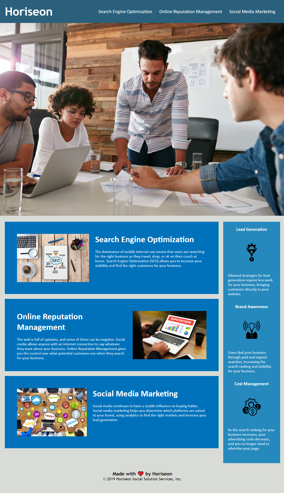

# Accessible Web App

## Description

Accessible Web App is a refactored live web application written in HTML to promote cleaner code and increase user accessbility.

## Installation

No special installation required!

## Usage

Use the Accessible Web App as reference for an application with semantic HTML & CSS elements in the source code that follow a logistical and clear structure.

## Author

This application was developed by Joshua Ordaz [https://github.com/winoza](https://github.com/winoza)

For any questions and for reporting bugs please open an issue.

## License

Distributed under the MIT License. See [LICENSE](https://choosealicense.com/licenses/mit/) for more information.

